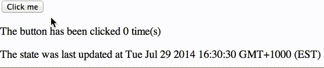

Making an Infinte Loop in React
====

Sometimes you can learn a lot about software by using it in the wrong way. The other day I stumbled upon an infinite loop in a [React](http://facebook.github.io/react/) component, so maybe you can learn from my mistake.

To show the behaviour in a simple way let's imagine a `ClickCounter` component that renders a button and shows how many times it's been clicked. We might start out with something like this:

```jsx
var react = require('react');

var ClickCounter = react.createClass({
    getInitialState: function () {
        return {
            numClicks: 0
        };
    },

    handleClick: function () {
        this.setState({
            numClicks: this.state.numClicks + 1
        });
    },

    render: function () {
        return (
            <div>
                <button onClick={this.handleClick}>Click me</button>
                <p>The button has been clicked {this.state.numClicks} time(s)</p>
            </div>
        );
    }
});
```

Now, let's say there's another requirement: the component needs to display the time of the most recent change in state. We start by adding the `lastStateChange` field:

```jsx
getInitialState: function () {
    return {
        numClicks: 0,
        lastStateChange: new Date()
    };
},
```

and add a new element to the `render()` function:

```jsx
<p>The state was last changed at {this.state.lastStateChange.toString()}</p>
```

The final piece is to update the value of `lastStateChange` whenever the component's state changes. All React components have a useful function `componentDidUpdate` that is called immediately after any state change. We could use that, right?

```jsx
componentDidUpdate: function () {
    this.setState({
        lastStateChange: new Date()
    });
},
```

Nope! When you click the button you'll see `Uncaught RangeError: Maximum call stack size exceeded` in the console. Thankfully we were stopped at the stack limit, otherwise this would have been an infinite recursion. The reason of course is clear when you think about it: calling `setState` triggers the `componentDidUpdate` once more.

Let's see what happens if we use a `setTimeout` to bypass recursion:

```jsx
componentDidUpdate: function () {
    var self = this;
    setTimeout(function () {
        self.setState({
            lastStateChange: new Date()
        });
    }, 1);
},
```

Ok, no errors in the console now. But take a look at the timestamp being rendered on the page:



Yes, we've just created the world's most inefficient realtime clock :) We've managed to mask the error, but this is still not doing what we want and will probably blow up at some point.

I'm not going to go into the "right" way to do this at the moment, since there are plenty of good options to choose from. But now at least we know to never ever modify state inside `componentDidUpdate`.
